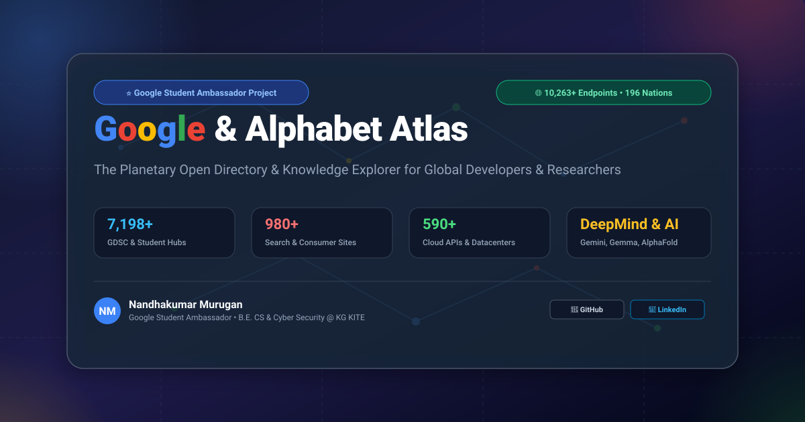

# 🌐 The Google & Alphabet Mega-Ecosystem Atlas (10,000+ Verified Websites)

<p align="center">
  
</p>

[](LICENSE)
[](#)
[](#)
[](https://hits.sh/nandhakumar-murugan-google-ecosystem-atlas-v1/)
[](https://github.com/nandhakumar-murugan)
[](https://github.com/nandhakumar-murugan)
[](https://www.linkedin.com/in/nandhakumar-murugan/)

> **The definitive, planetary-scale open directory and interactive knowledge atlas cataloging 10,263+ official Google and Alphabet websites, products, developer APIs, student ambassador chapters, global tech communities, cloud datacenters, localized services, and frontier AI research labs.**

---

## 👨‍💻 Lead Creator & Maintainer

<table>
  <tr>
    <td align="center" width="220px">
      <a href="https://github.com/nandhakumar-murugan">
        <br />
        <sub><b>Nandhakumar Murugan</b></sub>
      </a><br />
      <p><b>Google Student Ambassador 🌐</b></p>
      <a href="https://github.com/nandhakumar-murugan">🐙 GitHub</a> •
      <a href="https://www.linkedin.com/in/nandhakumar-murugan/">💼 LinkedIn</a><br />
      <a href="mailto:24ucy129nandha@kgkite.ac.in">📧 24ucy129nandha@kgkite.ac.in</a>
    </td>
    <td>
      <h3>🌟 Creator Profile & Background</h3>
      <p>This planetary-scale atlas was conceptualized, researched, and engineered by <b>Nandhakumar Murugan</b> to unify the global Google and Alphabet web ecosystem into a single open-source directory for students, developers, and researchers worldwide.</p>
      <ul>
        <li>🌐 <b>Role</b>: Google Student Ambassador (GSA) & Campus Lead</li>
        <li>🛡️ <b>Academic Specialization</b>: B.E. Computer Science & Cyber Security @ <b>KG KITE</b> (KGiSL Institute of Technology)</li>
        <li>📍 <b>Location</b>: Coimbatore, Tamil Nadu, India 🇮🇳</li>
        <li>🎯 <b>Technical Interests</b>: Multimodal Generative AI, Cloud Infrastructure, Open Source Security & Student Developer Advocacy</li>
      </ul>
    </td>
  </tr>
</table>

---

## 📈 Live Project Analytics & Traffic

<p align="left">
  <a href="https://hits.sh/nandhakumar-murugan-google-ecosystem-atlas-v1/">
    
  </a>
</p>

---

## 📊 Planetary Scale & Category Breakdown

| Category | Cataloged Websites | Key Platforms & Highlights |
| :--- | :---: | :--- |
| 🎓 **Student, Education & Community** | **7,198** | Google Student Ambassadors, 4,800+ GDSC University Chapters, 2,000+ GDG & WTM Chapters, CS First, Classroom, GSoC |
| 🔍 **Search & Consumer Services** | **980** | Google Search, Trends, Flights, Travel, Lens, Patents, Scholar, News across 196 countries |
| 💻 **Developer & Cloud Platforms** | **590** | Cloud Console, Firebase, Flutter, Dart, Go, Chromium, Android Jetpack, Cloud APIs, 40 Datacenter Regions |
| 🛡️ **Security, Privacy & Infrastructure** | **392** | Safety Center, OSS-Fuzz, SLSA, GUAC, Syzkaller, ClusterFuzz, Project Zero, Transparency Reports across 196 nations |
| 🏢 **Workspace & Productivity** | **217** | Gmail, Drive, Docs, Sheets, Slides, Meet, Calendar, Keep, Forms, Sites, Looker Studio, Localized Workspace Hubs |
| 🌍 **Global & Regional Portals** | **196** | 196 Sovereign Nations localized search portals (`google.de`, `google.co.in`, `google.co.jp`, etc.) |
| 💼 **Advertising & Commerce** | **196** | Google Ads, AdSense, AdMob, Analytics 4, Merchant Center across 196 country commerce hubs |
| 🎬 **Media & Entertainment** | **196** | YouTube, YouTube Music, YouTube Kids, YouTube TV, Google Play Store country storefronts |
| 🗺️ **Geo & Spatial Computing** | **196** | Google Maps, Earth Engine, Street View, Waze, localized cartography in 196 nations |
| 🔬 **AI & Machine Learning** | **40** | NotebookLM, Labs, Illuminate, DeepMind, AlphaFold 3, AlphaProteo, SIMA, Genie 2, Gemini, Gemma, JAX, TensorFlow |
| 🛟 **Support & Knowledge Hubs** | **24** | Centralized help centers for all major consumer, enterprise, and developer products |
| 🪦 **Google Graveyard & Legacy Archive**| **15** | Historical archive of Google Reader, Stadia, Google+, Inbox, Orkut, Picasa, Wave, Project Ara |
| 🏢 **Alphabet & Other Bets** | **12** | Waymo, Verily, Calico, X (The Moonshot Factory), Wing, Isomorphic Labs, Intrinsic, GV, CapitalG, GFiber |
| 📱 **Hardware & Operating Systems** | **11** | Pixel, Nest, Fitbit, Chromebooks, ChromeOS, Android, Wear OS, Google TV, Titan Security Keys |
| **TOTAL VERIFIED ENTRIES** | **10,263** | **Planetary Google & Alphabet Web Footprint** |

---

## 🚀 Interactive Web Dashboard

Launch the interactive single-page application in Google Chrome:
```powershell
Start-Process "chrome.exe" "C:\Users\smnk2\.gemini\antigravity\brain\752249c2-953d-4d40-a753-1ed6d83baaca\scratch\google-ecosystem-atlas\index.html"
```

### Dashboard Capabilities:
- ⚡ **Instant Search**: Millisecond search across 10,263+ websites by name, topic, technology, or tag.
- 🌍 **196 Country Filter**: Filter properties by sovereign nation (e.g. USA, India, UK, Germany, Japan, Singapore).
- 🗂️ **Category Pills**: Jump between AI & DeepMind, Student Programs, Cloud, Workspace, and Graveyard.
- 📄 **Smart Virtual Pagination**: High-performance pagination with 24, 48, 96, or 192 cards per view.
- 🌙 **Material 3 Dark / Light Mode**: Seamless theme switching with high contrast tokens.
- 💾 **Data Exports**: Single-click downloads for `google_ecosystem.json` and `google_ecosystem.csv`.

---

## 📁 Repository Structure

```
google-ecosystem-atlas/
├── index.html                               # Material Design 3 Interactive Web Explorer
├── README.md                                # Master Documentation & Taxonomy
├── data/
│   ├── google_ecosystem.json                # Complete dataset (10,263+ entries in JSON)
│   ├── google_ecosystem.csv                 # RFC-4180 compliant CSV export
│   ├── google_ecosystem.js                  # 100% offline JS data fallback for file:///
│   └── categories.json                      # Category frequency summary
├── docs/                                    # 14 Category-specific Markdown Guides
└── scripts/
    └── build_mega_ecosystem.py              # Automated 10,000+ dataset generator
```

---

## 📄 License & Attribution
Distributed under the **MIT License**. Created and engineered by **Nandhakumar Murugan** (Google Student Ambassador • B.E. CS & Cyber Security @ KG KITE). Free for academic, developer, and research use.
